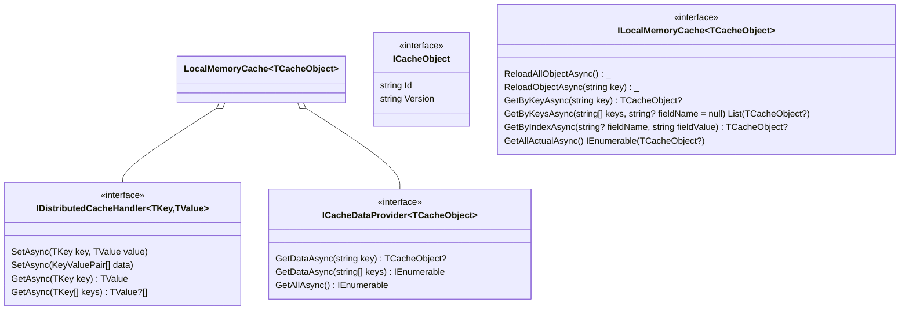

# Caching - распределенное кеширование

[[_TOC_]]

## Диаграмма классов



## Информация

Кэшируемая сущность должна наследоваться от ICacheObject, а свойства, по которым далее будем получать значение из Redis и memoryCache помечаются аттрибутами {+ [CacheKey] +},  {+ [CacheIndex] +}, при этом значения, хранящиеся в Redis одинаковы для всех типов ключей (см. примеры ниже)

> Важно! - аттрибут [CacheKey] - должен быть 1 на сущность.

{+ Пример хранения [CacheKey] в Redis: +} 
Ключ:
```
User.ImmutabilityId.191904bb-7635-48df-a477-c6d2d02d1538
```
Значение: 
```json
{
    "Id": "191904bb-7635-48df-a477-c6d2d02d1538",
    "Version": "3"
}
```
> [CacheIndex] - данных атрибутов может быть несколько, на разных свойствах сущности, при этом если важно, чтобы ключ хранился в нижнем регистре, в конструктор атрибута необходимо передать флаг: [CacheIndex(ToLower = true)]

{+ Пример хранения [CacheIndex(ToLower = true)] в Redis: +}

Ключ:
```
User.Name.ivanpetrov
```
Значение:
```json
{
"Id": "191904bb-7635-48df-a477-c6d2d02d1538",
"Version": "4"
}
```


[CacheIndex]
Ключ:
```
User.Id.10
```
Значение:
```json
{
"Id": "191904bb-7635-48df-a477-c6d2d02d1538",
"Version": "4"
}
```

## Использование

- Подключить в сервисе-потребителе данного пакета зависимости:

> services.AddCaching<User, UserCacheDataProvider>();

- Реализовать класс, реализующий ICacheDataProvider<TCacheObject>, который отвечает за предоставление данных при кэш-промахе*  
- Инжектим ILocalMemoryCache<User> в сервис, все запросы сущности User осуществляем через публичные методы интерфейса ILocalMemoryCache
- При изменении сущности (и сохранении в БД) необходимо выполнять метод ILocalMemoryCache.ReloadObjectAsync(key) для актуализации данных в Redis и в Memory Cache

* Под кэш-промахом подразумевается один из нескольких случаев: кэшируемый объект не найден в Memory Cache или версия кэшируемого объекта в Memory Cache не совпадает с версией в Redis
